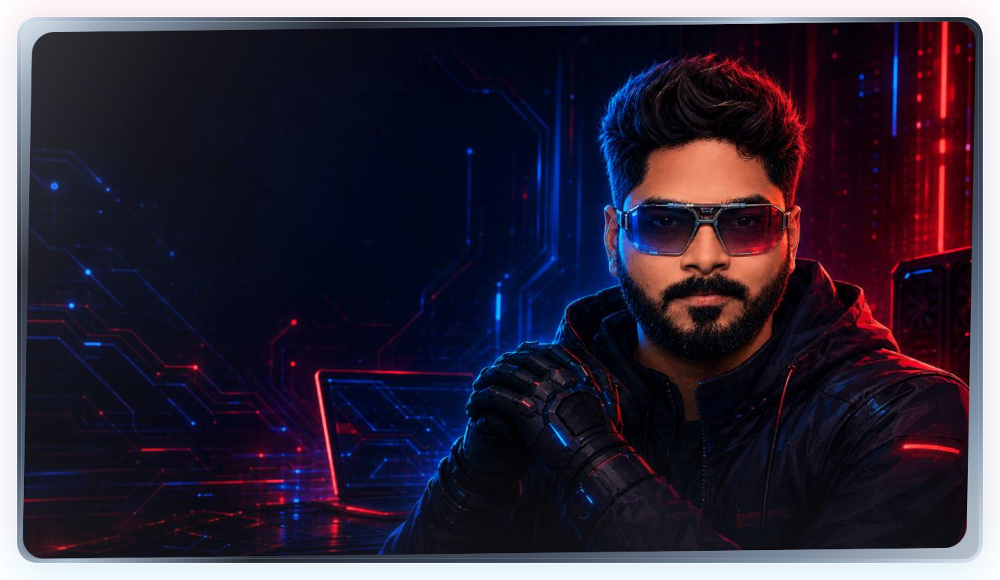

  

 

  
  
  
  

<h1 align="center">
  
</h1>

  UTKARSH KUMAR RAUT

  
  
  

  Founder and software architect securing the vehicle ecosystem — from chip to cloud — with embedded engineering, security telemetry, and AI-assisted operations.

  
  
  

 

  
  

## About&nbsp;&nbsp;

A DECADE OF TURNING COMPLEX TECHNOLOGY INTO DEPENDABLE SYSTEMS

I operate at the intersection of **technology, product, and execution** — taking systems from concept to production with measurable outcomes.

Today my work centers on **automotive cybersecurity**, **software-defined vehicle (SDV) ecosystems**, and **connected mobility**: embedded platforms, secure architecture, compliance-minded engineering, and intelligent monitoring across the vehicle lifecycle.

As a founder, I’ve also built and shipped analytics, automation, and learning platforms — always with the same bar: production-ready, ownable, and built to last.

10+ years designing and delivering platforms across data, cloud, and security — leading teams with a bias for ownership and delivery.

  
  

## Current focus&nbsp;&nbsp;

SECURING MODERN MOBILITY FROM EMBEDDED SOFTWARE TO INTELLIGENT OPERATIONS

<table>
<tr>
<td width="50%" valign="top">

### 

- Vehicle security architecture across chip, ECU, and cloud
- Connected mobility, SDV interfaces, and trust boundaries
- Secure design, validation, and compliance-aware engineering

</td>
<td width="50%" valign="top">

### 

- Systems software for constrained, safety-conscious environments
- Reliable firmware-adjacent and platform-level engineering
- Bridging embedded realities with enterprise security needs

</td>
</tr>
<tr>
<td width="50%" valign="top">

### 

- High-volume ingestion, normalization, and detection-ready data
- Auditability and operational visibility across vehicle and infra signals
- Pipelines built for real SOC and monitoring workloads

</td>
<td width="50%" valign="top">

### 

- Workflows that triage, enrich, and prioritize security alerts
- AI where it reduces noise and accelerates decisions — not spectacle
- Practical automation inside live security operations

</td>
</tr>
</table>

### From vehicle signal to security decision

> [!NOTE]
> **Every stage below opens.** Expand one to see the actual engineering work at that layer — the constraints, the trust boundaries, and the decisions that matter.

<code>$ inspect --stage chip-ecu</code>

 

Embedded C/C++ in constrained, safety-conscious environments. Timing, memory,
and failure behaviour are design constraints — not tuning done afterwards.
This is where the trust boundary physically begins.

<code>$ inspect --stage vehicle-trust</code>

 

Security architecture for connected mobility and SDV interfaces: identity,
authorization, least privilege, and vehicle-state rules. Diagnostic and
service-oriented access is treated as an attack surface, so it gets threat
modelled and governed rather than simply exposed.

<code>$ inspect --stage telemetry</code>

 

Turning raw device and platform signals into detection-ready data: ingestion,
normalization, lineage, and traceability. If the log cannot be trusted or
attributed, nothing downstream of it can be either.

<code>$ inspect --stage siem</code>

 

High-volume security pipelines shaped around how analysts actually work —
auditability, context on the alert, and evidence that holds up during review.
Built for real monitoring workloads, not dashboard screenshots.

<code>$ inspect --stage ai</code>

 

AI applied where it removes load: triage, enrichment, correlation, and
prioritization. The goal is fewer, better alerts reaching a human — never
generated confidence that an analyst then has to disprove.

<code>$ inspect --stage decision</code>

 

The output is a governed response a human owns, with the reasoning traceable
back through the pipeline to the originating signal. Feedback returns to
detection so the system sharpens instead of drifting.

 

  
  

## Systems I have helped shape&nbsp;&nbsp;

PREVIOUSLY BUILT AND LED; NOW SUSTAINED BY MY TEAM UNDER MY MENTORSHIP AND STRATEGIC GUIDANCE

<code>$ ls --domain enterprise-operations</code>

 

- Supply-chain demand forecasting and planning
- SLA-driven control towers and operational visibility
- Fleet and route optimization systems
- Mobile workflows for warehouse automation

<code>$ ls --domain digital-products</code>

 

- E-commerce and transaction platforms
- EdTech and online test series (OTS)
- Rank prediction and performance analytics
- Automation-led internal business tools

 

These systems remain active under team ownership. I contribute through **mentoring, architecture reviews, product direction, and focused updates** rather than day-to-day delivery.

  
  

## How I work&nbsp;&nbsp;

TECHNICAL DEPTH, BUSINESS CONTEXT, AND ACCOUNTABLE EXECUTION

- &nbsp; Architecture and delivery owned end to end
- &nbsp; Applied across APIs, data flows, and integrations
- &nbsp; Technical depth balanced with business and compliance priorities
- &nbsp; Distributed teams led with clarity, accountability, and speed

  
  

## Working stack&nbsp;&nbsp;

A FOCUSED TOOLKIT, CHOSEN AROUND THE SYSTEM — NOT THE TREND

  

  
  
  
  

Background across product backends, data systems, and security tooling when the problem needs it.

  
  

## Open to&nbsp;&nbsp;

SELECTIVE COLLABORATIONS WHERE SECURITY, SCALE, AND OWNERSHIP MATTER

- &nbsp; Cybersecurity, SDV, and embedded engineering
- &nbsp; Pipelines, detection engineering, and SOC automation
- &nbsp; Security operations and alert intelligence
- &nbsp; Technical partnerships with clear ownership

I work best with teams that value **precision, accountability, and long-term system integrity**.

  
  
  

  
  

## Connect&nbsp;&nbsp;

FOR THOUGHTFUL CONVERSATIONS ABOUT MOBILITY, SECURITY, AND APPLIED AI

- LinkedIn: <a href="https://www.linkedin.com/in/karshe/" target="_blank" rel="noopener noreferrer">linkedin.com/in/karshe</a>
- Website: <a href="https://karshe.in/" target="_blank" rel="noopener noreferrer">karshe.in</a>
- Email: <a href="mailto:utkarsh2point0@gmail.com?subject=Collaboration%20Inquiry%20%E2%80%94%20iamkarshe" target="_blank" rel="noopener noreferrer">utkarsh2point0@gmail.com</a>

 

  
  
  
  

  <strong>Securing mobility</strong> — from chip to cloud, from signal to decision.

 

  <code>&lt;krafted by karshe /&gt;</code>

