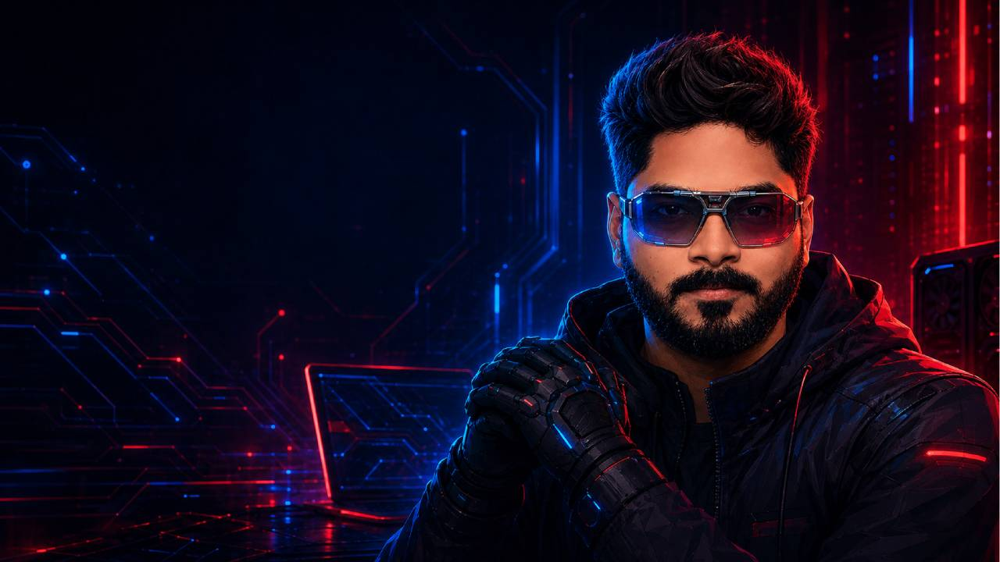

  

 

  
  
  
  

<h1 align="center">Utkarsh Kumar Raut</h1>

  
  
  

  Founder and software architect securing the vehicle ecosystem — from chip to cloud — with embedded engineering, security telemetry, and AI-assisted operations.

  
  
  

 

  
  

##  About

I operate at the intersection of **technology, product, and execution** — taking systems from concept to production with measurable outcomes.

Today my work centers on **automotive cybersecurity**, **software-defined vehicle (SDV) ecosystems**, and **connected mobility**: embedded platforms, secure architecture, compliance-minded engineering, and intelligent monitoring across the vehicle lifecycle.

As a founder, I’ve also built and shipped analytics, automation, and learning platforms — always with the same bar: production-ready, ownable, and built to last.

10+ years designing and delivering platforms across data, cloud, and security — leading teams with a bias for ownership and delivery.

  
  

##  Focus

<table>
<tr>
<td width="50%" valign="top">

### 

- Vehicle security architecture across chip, ECU, and cloud
- Connected mobility, SDV interfaces, and trust boundaries
- Secure design, validation, and compliance-aware engineering

</td>
<td width="50%" valign="top">

### 

- Systems software for constrained, safety-conscious environments
- Reliable firmware-adjacent and platform-level engineering
- Bridging embedded realities with enterprise security needs

</td>
</tr>
<tr>
<td width="50%" valign="top">

### 

- High-volume ingestion, normalization, and detection-ready data
- Auditability and operational visibility across vehicle and infra signals
- Pipelines built for real SOC and monitoring workloads

</td>
<td width="50%" valign="top">

### 

- Workflows that triage, enrich, and prioritize security alerts
- AI where it reduces noise and accelerates decisions — not spectacle
- Practical automation inside live security operations

</td>
</tr>
</table>

  
  

##  How I work

- Strong ownership of architecture and delivery end to end
- Secure-by-design across APIs, data flows, and integrations
- Balance technical depth with business and compliance priorities
- Lead distributed teams with clarity, accountability, and speed

  
  

##  Stack I work with

  

  
  
  
  

Background across product backends, data systems, and security tooling when the problem needs it.

  
  

##  Open to

Selective conversations around:

- Automotive cybersecurity, SDV, and embedded engineering
- SIEM pipelines, detection engineering, and SOC automation
- AI-assisted security operations and alert intelligence
- Founding / technical partnerships with clear ownership

I work best with teams that value **precision, accountability, and long-term system integrity**.

  
  
  

  
  

##  Connect

- LinkedIn: [linkedin.com/in/karshe](https://www.linkedin.com/in/karshe/)
- Website: [karshe.in](https://karshe.in/)
- Email: [utkarsh2point0@gmail.com](mailto:utkarsh2point0@gmail.com?subject=Collaboration%20Inquiry%20%E2%80%94%20iamkarshe)

 

  
  
  
  

  <strong>Securing mobility</strong> — from chip to cloud, from signal to decision.

